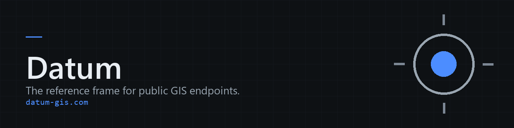

  

  <a href="https://datum-gis.com"><b>datum-gis.com</b></a>
  &nbsp;&middot;&nbsp;
  <a href="../../issues/new?template=add-server.yml">Add a server</a>
  &nbsp;&middot;&nbsp;
  <a href="../../issues/new?template=update-server.yml">Report a problem</a>

---

# Submissions

Additions and corrections for [Datum](https://datum-gis.com), a directory of
public government ArcGIS REST endpoints in the United States: federal, state,
regional, county and city, with the statewide clearinghouses and metro data
portals alongside them.

This repository holds the submission forms. Open an issue here and it reaches
the maintainer.

## Add a server

**[Open a submission](../../issues/new?template=add-server.yml)** for a public
ArcGIS REST endpoint that is not listed yet.

What makes a good one:

| | |
|---|---|
| **The address** | The top level `.../rest/services` root, not a single layer and not a folder. Drop any `?f=json`. |
| **Who runs it** | The agency or jurisdiction, and whether it is federal, state, county, city, tribal, or regional. |
| **In scope** | US government and public interest servers. Not private companies, and not Esri's own platform services. |
| **Open** | It has to load without a login. A server that answers on the root and asks for a token on every service is listed as needing one. |

## Report a problem

**[Open a request](../../issues/new?template=update-server.yml)** when a URL has
moved, a server has gone, or a record is filed under the wrong agency, level or
state.

The id is at the end of the address on any endpoint page, and reads like
`srv-eb630f95`. An organization id works too.

## Either way

The forms on the site prefill these for you, at
[/contribute/add/](https://datum-gis.com/contribute/add/) and
[/contribute/change/](https://datum-gis.com/contribute/change/). You still
review and submit the issue yourself.

Please leave personal contact details out. A link to the agency's own published
contact page is what is wanted; the directory does not carry individual names,
addresses or phone numbers.

---

Datum &copy; 2026 Jacob Hogue. Submissions to this repository are released under
<a href="https://creativecommons.org/licenses/by-nc/4.0/">CC BY-NC 4.0</a>, which
keeps them compatible with the terms the directory itself carries.

